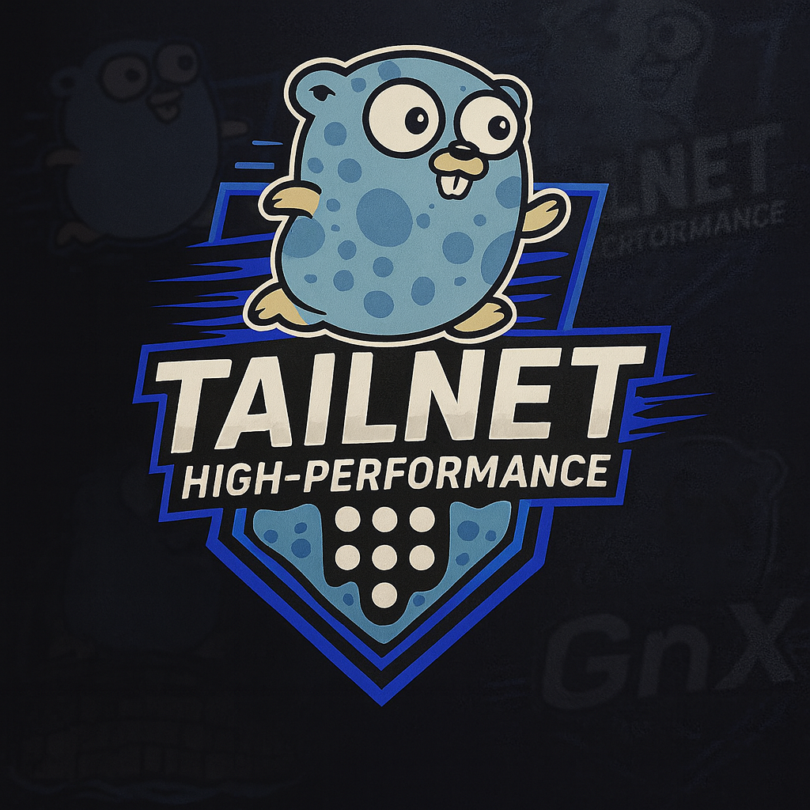

<h1 align="center">Tailnet Proxmox</h1>

<p align="center">
  
</p>

<p align="center"><strong>Proxmox VE containerizado con KVM, tres bridges y acceso privado mediante Tailscale.</strong></p>

## Version

Current release: `v0.0.1`

Repository: [github.com/mayas-alas/tailnet-proxmox](https://github.com/mayas-alas/tailnet-proxmox)

Container image: `ghcr.io/mayas-alas/tailnet-proxmox:0.0.1`

## Included

- Proxmox VE running with systemd inside Docker.
- KVM acceleration through `/dev/kvm`.
- Three Docker interfaces mapped to `vmbr0`, `vmbr1` and `vmbr2`.
- NAT, DHCP and DNS for internal guests.
- Persistent Proxmox configuration and storage.
- Private HTTPS access through Tailscale Serve.
- SSH forwarding from Tailnet port `2222` to the PVE host.

## Requirements

- Docker Desktop on Windows 11 or Docker Engine on Linux.
- Nested virtualization and a working `/dev/kvm` device.
- `/dev/net/tun` for the Tailscale sidecar.
- A reusable or ephemeral Tailscale authentication key.
- At least 2 GB of RAM and 32 GB of available storage.

## Configuration

Create `.env` from `.env.example` and provide your Tailnet values:

```dotenv
TS_AUTHKEY=
TS_HOSTNAME=proxmox
TS_CERT_DOMAIN=proxmox.example-tailnet.ts.net
PASSWORD=root
DEVS=eth0 eth1 eth2
BRIDGES=vmbr0 vmbr1 vmbr2
GATEWAYS=172.30.10.1 172.30.11.1 172.30.12.1
```

The real `.env` file is ignored by Git. Do not commit Tailscale keys or production passwords.

## Start

On Docker Desktop, ensure KVM is available before starting the stack:

```powershell
wsl -d docker-desktop sh -lc "modprobe kvm_amd 2>/dev/null || modprobe kvm_intel"
docker compose pull
docker compose up -d
```

Check service health:

```powershell
docker compose ps
docker compose exec tailscale tailscale serve status
```

To update after a release:

```powershell
docker compose pull
docker compose up -d
```

Because the repository and package are private, Docker must be authenticated to `ghcr.io` with a token that has `read:packages` permission.

## Access

The Proxmox panel is intentionally not published on a host port. Open the HTTPS address configured in `TS_CERT_DOMAIN` from a device connected to the same Tailnet.

SSH to the PVE system is forwarded through Tailnet port `2222`:

```bash
ssh -p 2222 root@proxmox
```

Tailscale SSH remains enabled on the sidecar itself. Port `2222` is the explicit path to the PVE SSH service.

## Networking

| Docker NIC | PVE bridge | Guest gateway |
| --- | --- | --- |
| `eth0` | `vmbr0` | `172.30.10.1` |
| `eth1` | `vmbr1` | `172.30.11.1` |
| `eth2` | `vmbr2` | `172.30.12.1` |

The Tailscale sidecar joins only `pve0`. Proxmox remains connected to all three Docker networks and exposes its internal HTTPS and SSH services to the sidecar through the `pve-backend` alias.

## Persistence

| Host path | Container path | Purpose |
| --- | --- | --- |
| `./config` | `/var/lib/pve-cluster` | PVE cluster and node configuration |
| `./data` | `/var/lib/vz` | Templates, ISO images, backups and virtual disks |
| `tailscale-state` | `/var/lib/tailscale` | Tailscale identity and state |

Removing the Proxmox container does not delete these paths. Deleting `config` or `data` starts the corresponding PVE state from scratch.

## Security Notes

- The Proxmox web interface has no host port binding by default.
- Tailscale Serve terminates trusted Tailnet HTTPS and proxies to PVE's internal self-signed HTTPS endpoint.
- Tailnet ACLs and SSH rules still determine who can connect.
- The PVE firewall services are masked because they conflict with the container-managed NAT layout.

## License And Trademarks

See [license.md](license.md). Proxmox product names and trademarks belong to their respective owners. This project is not affiliated with or endorsed by Proxmox Server Solutions GmbH.
